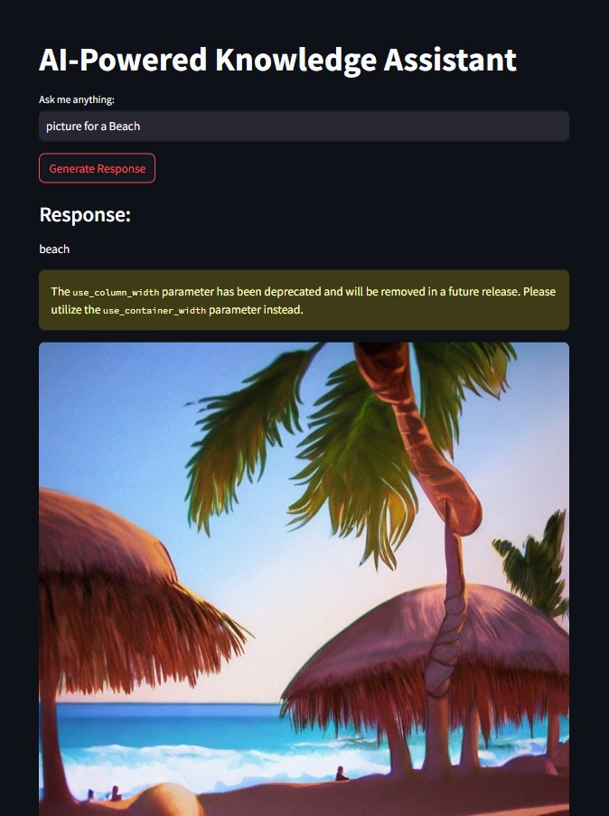

# AI-Powered Knowledge Assistant

## Overview

The AI-Powered Knowledge Assistant is a multi-modal AI system that integrates **Retrieval-Augmented Generation (RAG), a fine-tuned LLM (Flan-T5), and Stable Diffusion** to generate both textual and visual content. This project is designed for **AI-driven marketing content generation**, allowing users to retrieve information, generate responses, and create AI-generated images dynamically.

---

## Features

- ✅ **Retrieval-Augmented Generation (RAG)** – Uses FAISS and sentence transformers to retrieve relevant knowledge for enhanced response generation.
- ✅ **Fine-Tuned LLM (Flan-T5)** – Generates high-quality, context-aware text responses based on retrieved information.
- ✅ **Stable Diffusion Image Generation** – Converts AI-generated text into **user-customized images** for marketing purposes.
- ✅ **Streamlit UI for Interaction** – Provides an easy-to-use front-end where users can input queries and receive multi-modal responses.
- ✅ **Flask API for Backend Processing** – Handles text generation locally and integrates with Google Colab for image generation.

---

## Screenshots



## Technology Stack

- **Backend:** Flask, PyTorch, Transformers, FAISS, SentenceTransformers
- **Frontend:** Streamlit
- **LLM:** Google Flan-T5 (Small)
- **Retrieval:** FAISS for fast knowledge retrieval
- **Image Generation:** Stable Diffusion (via Google Colab)
- **Deployment:** Ngrok for API tunneling

---

### Installation & Setup

1️⃣ Clone the Repository

```bash
git clone https://github.com/codebyrohith/Week-8-Hands-On.git
cd Week-8-Hands-On
```

2️⃣ Set Up a Virtual Environment (Optional but Recommended)

```bash
python -m venv venv
source venv/bin/activate # On Mac/Linux
venv\Scripts\activate # On Windows
```

3️⃣ Install Dependencies

```bash
pip install -r requirements.txt
```

4️⃣ Run the Flask API (For Text Generation)

```bash
python flask_app.py
```

5️⃣ Set Up Stable Diffusion (Google Colab)

Open the provided Google Colab notebook.
Run all the cells to start the Stable Diffusion API.
Copy the Ngrok URL displayed at the end of the notebook.
Update the COLAB_API_URL variable in app.py with the new Ngrok URL.

6️⃣ Run the Streamlit App

streamlit run app.py

---

### Usage

- Open the Streamlit UI (http://localhost:8501).
- Enter a question or prompt in the text box.
- Click "Generate Response" to retrieve relevant information and generate text.
- The AI will display a response and send it to Stable Diffusion for image generation.
- The generated image will appear below the response.

---

### Future Enhancements

- Upgrade to larger LLM models for better response generation.
- Improve image customization options (e.g., style, colors, aspect ratio).
- Deploy the entire system to the cloud (AWS, Hugging Face Spaces, etc.).
